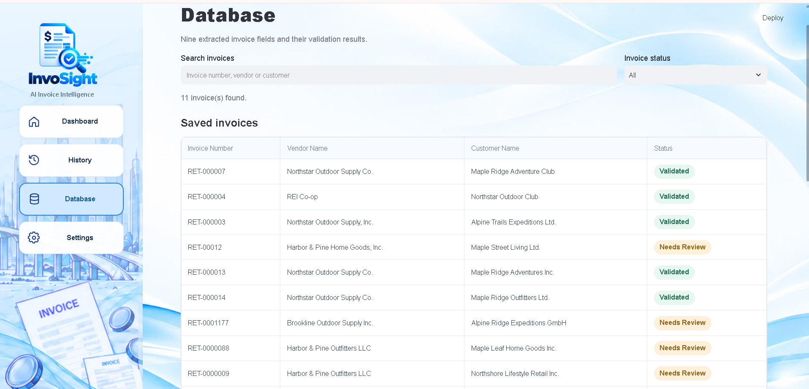
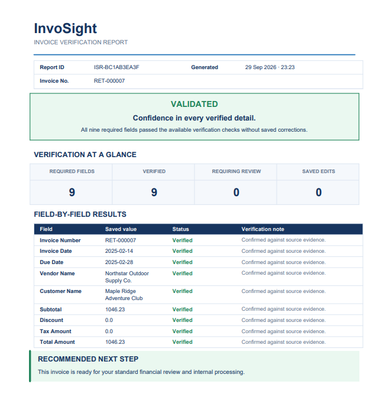

<div align="center">

# InvoSight

### AI-Powered Invoice Extraction, Verification & Financial Intelligence

**From Invoices to Insights**

*Turning invoice documents into structured information and actionable verification results.*

</div>

---

## 📌 Overview

**InvoSight** is an AI-powered invoice-processing system designed to reduce repetitive manual work in financial document review. Instead of locating and checking every invoice field by hand, users can upload an invoice image, extract essential information, review automated verification results, correct values when necessary, and generate a professional verification report.

InvoSight combines document understanding, OCR-based evidence, financial validation rules, and a Streamlit interface to make invoice processing more organized and transparent. Depending on the hardware and document complexity, initial extraction and verification can potentially finish in seconds; processing-time benchmarks have not yet been published.

## 🖥️ Application Preview

### Interactive Dashboard — Extract, Verify & Review

The **InvoSight Dashboard** brings the invoice-processing workflow into one interactive workspace. Users can upload an invoice image, view the original document alongside its extracted fields, inspect verification results, correct values when necessary, and export structured data or a professional report. Its summary cards distinguish statistics for saved database records from verification results for the current invoice.

<p align="center">
  
</p>

*Figure 1. The main InvoSight dashboard for invoice extraction and verification.*

## 🎯 The Challenge & Our Solution

### The challenge

Financial teams often spend considerable time manually entering invoice information, checking figures, comparing extracted details with source documents, and recording verification outcomes. Invoice layouts vary, and even automated extraction can produce fields that need further review.

### Our solution

InvoSight brings the workflow into a single application: **upload → extract → verify → review → save → report**. Automated checks help teams focus on discrepancies or insufficiently verified information rather than repeating every check manually. The goal is to reduce repetitive effort and support more consistent, informed financial document review—not to replace final human approval.

## 🧾 Dataset Development

### AI-Assisted Synthetic Invoice Generation

The project uses approximately **10,000 synthetic, single-page invoice images** and corresponding structured JSON records, generated across **20 invoice templates**. Rather than using real customer invoices, the team developed a custom Python-based data-generation and rendering workflow:

1. **Generate synthetic invoice content with OpenAI:** Generate fictional invoice details, including invoice identifiers, supplier and customer information, dates, line items, and financial values, and organize them into structured records.
2. **Check financial consistency with Python:** Apply programmatic checks to the generated amounts and relationships between invoice fields.
3. **Render invoice images with Pillow:** Use Python's Pillow imaging library to draw the generated information—including text, tables, and financial totals—onto predefined invoice templates.
4. **Pair images and annotations:** Associate each rendered invoice with its corresponding JSON data for model development and evaluation.

| Dataset property | Description |
|---|---|
| Type | Synthetic invoice dataset |
| Size | Approximately 10,000 single-page invoices |
| Layout variations | 20 templates |
| Content generation | OpenAI |
| Rendering and validation | Python and Pillow |
| Annotations | Structured JSON |

The dataset and trained model weights are not included in this repository.

## ⚙️ System Architecture

| Component | Technology | Purpose |
|---|---|---|
| Document extraction | Fine-tuned Donut | Extracts structured invoice information from images |
| Independent OCR evidence | Tesseract OCR | Provides additional document evidence for verification |
| Validation engine | Python | Evaluates source evidence and financial consistency |
| Interactive application | Streamlit | Provides invoice upload, review, editing, and export |
| Record management | SQLite | Stores and retrieves invoice records |
| PDF reporting | ReportLab | Generates verification reports with recommended next steps |

A calculation that passes does not, by itself, prove that an extracted or edited amount matches the original invoice. InvoSight distinguishes the verification evidence available for each field.

## ✨ Key Features

- **Intelligent extraction:** Organizes essential information from uploaded PNG or JPG invoice images.
- **Multi-layer verification:** Checks extracted values against available OCR evidence and financial rules.
- **Discrepancy detection:** Highlights mismatches, missing information, and fields requiring further review.
- **Interactive corrections:** Supports manual field updates and recalculates related financial amounts where applicable.
- **Validation dashboard:** Displays field-level outcomes and a summary of the current invoice.
- **Invoice history and database:** Enables access to and management of previously saved records.
- **Structured exports:** Downloads invoice data in JSON format.
- **Professional PDF reports:** Summarizes results, saved corrections, outstanding verification, and recommended next steps.

## 🗂️ Extracted Invoice Fields

| Field | Description |
|---|---|
| Invoice Number | Unique invoice identifier |
| Invoice Date | Invoice issue date |
| Due Date | Payment due date |
| Vendor Name | Issuing supplier |
| Customer Name | Receiving customer |
| Subtotal | Amount before discounts and tax |
| Discount | Applied discount amount |
| Tax Amount | Applicable tax amount |
| Total Amount | Final invoice amount |

## 🔎 Verification & Review

| Status | Meaning |
|---|---|
| **Valid** | Field passed the available verification checks |
| **Needs Review** | Field has a discrepancy or insufficient verification evidence |
| **Modified** | User changed the originally extracted value |
| **Modified & Verified** | Saved correction passed independent source verification |
| **Pending Verification** | Saved change requires independent source confirmation |

Modification status and verification status describe different things: a field may have been edited and subsequently verified, or remain pending confirmation.

## 🧭 Application Pages & Screenshots

| Page | Purpose |
|---|---|
| **Dashboard** | Upload, extract, review, edit, validate, and export invoices |
| **History** | Review previously saved invoices and recent updates |
| **Database** | Search, access, edit, and manage stored invoices |
| **Settings** | Manage general application and display preferences |

### Database — Organized Financial Records

The **Database** page provides a centralized view of saved invoices. Users can search and filter records, review their verification status, inspect stored invoice information, and manage saved entries. This helps teams keep invoice records accessible and focus on documents that require follow-up.

<p align="center">
  
</p>

*Figure 2. Invoice database and record-management interface.*

### Verification Report — Clear Results & Recommended Actions

The **Verification Report** converts automated checks into a structured PDF for review and documentation. It summarizes verified fields, highlights discrepancies, distinguishes pending verification from confirmed corrections, and provides recommended next steps based on the invoice's verification outcome. The report supports informed review; it is not final payment approval.

<p align="center">
  
</p>

*Figure 3. An example verification report generated by InvoSight.*

## 🛠️ Technology Stack

**Python** · **Streamlit** · **PyTorch** · **Hugging Face Transformers** · **Donut** · **Tesseract OCR** · **Pillow** · **SQLite** · **ReportLab** · **Git & GitHub**

## 📁 Repository Structure

```text
InvoSight/
├── Dashborad.py
├── Database.py
├── Dount_backend.py
├── ocr_evidence.py
├── validation_rules.py
├── report_generator.py
├── InvoSight_Assets/
│   ├── logo-full.png
│   ├── dashboard-background.png
│   ├── dashboard-preview.png
│   ├── database-preview.png
│   └── report-preview.png
├── requirements.txt
├── packages.txt
├── .gitignore
└── README.md
```

The local virtual environment, model weights, dataset, application preferences, and local database are excluded from version control.

## 🚀 How to Run the Application

### 1. Clone the repository

```bash
git clone https://github.com/wejdan20fa/InvoSight.git
cd InvoSight
```

### 2. Create and activate a virtual environment

```bash
python -m venv .venv
```

**Windows (PowerShell):**

```powershell
.\.venv\Scripts\Activate.ps1
```

**macOS / Linux:**

```bash
source .venv/bin/activate
```

### 3. Install Python dependencies

```bash
python -m pip install -r requirements.txt
```

### 4. Configure OCR and model files

Install the Tesseract OCR executable and ensure it is available to the application. Download or obtain the team's trained model files separately and place them in `final_model_DOUNT/` at the project root. The application cannot perform extraction without its trained model files.

### 5. Run the dashboard

```bash
streamlit run Dashborad.py
```

Streamlit typically opens the application at `http://localhost:8501`.

## 📊 Project Outcomes & Organizational Value

InvoSight demonstrates an integrated workflow from custom synthetic data generation and invoice extraction to evidence-based verification, interactive review, record management, and professional reporting.

**For financial teams, the intended benefit is less manual checking and more attention to exceptions.** A user can submit an invoice instead of manually transcribing and checking every field, then inspect the system's verification results and focus on flagged information. Processing time varies with hardware and invoice complexity; quantitative time savings and production-scale accuracy have not yet been established.

## ⚠️ Known Limitations

- Extraction performance may vary with invoice layout, resolution, and image quality.
- OCR evidence can be incomplete when text is overlapping, unclear, or difficult to recognize.
- Financial consistency checks do not independently establish agreement with the original invoice.
- Edited values may require additional source verification.
- Performance on diverse real-world invoices requires further evaluation.
- Automated verification supports review; it does **not** constitute final financial or payment approval.

## 👥 InvoSight Development Team

- **Wejdan Alnafai**
- **Nehal Alzahrani**
- **Saja Albuqami**
- **Reham Alhejaili**
