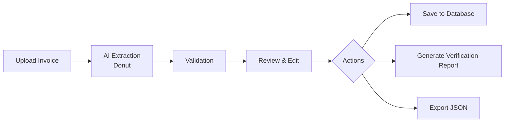

<div align="center">

# InvoSight

### AI-Powered Invoice Extraction, Verification & Financial Intelligence

**From Invoices to Insights**

*Turning invoice documents into structured information, clear validation results, and review-ready records.*

🚀 **[Try InvoSight — Click Here](https://invosight.streamlit.app/)**

[GitHub Repository](https://github.com/wejdan20fa/InvoSight)

</div>

---

## 📌 Overview

**InvoSight** is an end-to-end AI-powered invoice processing and verification system designed to make invoice review more structured, efficient, and transparent.

The system extracts key information directly from invoice images using a fine-tuned **Donut deep learning model**, validates the extracted values using independent OCR evidence and financial rules, highlights fields that require attention, allows users to review and correct values when needed, and stores the final records for future access.

The complete workflow is handled in one interface:

**Upload → Extract → Validate → Review & Edit → Take Action**

After validation, the user can choose one of three actions:

- **Save to Database**
- **Generate Verification Report**
- **Export JSON**

---

## 🖥️ Application Preview

### Interactive Dashboard — From Invoice to Insight

The **InvoSight Dashboard** brings the complete invoice-processing workflow into one interactive workspace.

Users can upload an invoice image, view the original document, extract structured information with the AI model, inspect field-level validation results, review or edit extracted values, and choose the next action after verification.

The dashboard also includes summary cards for saved invoices, validated records, invoices requiring review, and modified invoices, while keeping the invoice viewer, extracted information, and validation summary visible together.

<p align="center">
  
</p>

*Figure 1. The main InvoSight dashboard.*

---

## 🎯 The Challenge & Our Solution

### The Challenge

Invoice processing is more than simply reading or entering text.

Financial teams often need to:

- Identify important invoice fields.
- Enter or review invoice information manually.
- Verify that extracted values match the original invoice.
- Check financial relationships and calculations.
- Detect missing, suspicious, or inconsistent values.
- Correct errors when necessary.
- Keep a clear record of the final reviewed result.

When this process is repeated across a large number of invoices, manual review becomes **time-consuming, repetitive, and prone to human error**. This can slow financial workflows and make discrepancies harder to identify consistently.

### Our Solution

**InvoSight** combines deep learning-based document extraction, independent OCR evidence, financial validation, human review, and structured record management in one system.

The invoice image is first processed by a fine-tuned **Donut model**, which extracts the required invoice information directly from the document image.

The extracted values are then passed to the validation layer, where **Tesseract OCR is used as an independent source of textual evidence from the original invoice image**. This evidence is compared with the Donut output, while Python validation rules check financial consistency between invoice amounts.

The result is not simply extracted data. InvoSight clearly identifies what has been validated and what still requires human attention.

### How InvoSight Works



#### 1. Upload Invoice

The user uploads an invoice image in **PNG or JPG** format.

#### 2. AI Extraction

The fine-tuned **Donut deep learning model** analyzes the invoice image and converts the required information into structured invoice fields.

#### 3. Validation

The extracted information is checked using two complementary validation sources:

- **OCR evidence:** Tesseract OCR reads text independently from the original invoice image and provides evidence that can be compared with the Donut model output.
- **Financial validation:** Python rules check the relationships between financial values such as subtotal, discount, tax, and total.

Each field receives a validation result so the user can quickly identify values that passed the checks and fields that still need attention.

#### 4. Review & Edit

The user reviews the extracted values together with their validation results. If a value needs correction, it can be edited before the final result is saved or exported.

#### 5. Actions

After validation and review, the user can choose one of three actions:

**Save to Database**  
Store the invoice, extracted values, and validation results for later access through the History and Database pages.

**Generate Verification Report**  
Create a structured PDF report containing invoice information, validation results, identified issues, modifications, and review information.

**Export JSON**  
Download the extracted invoice data in a structured JSON format for reuse in other workflows or systems.

---

## 🧾 Dataset Development

### AI-Assisted Synthetic Invoice Generation

The project uses approximately **10,000 synthetic single-page invoice images** with corresponding structured JSON records across **20 invoice templates**.

Synthetic invoices were used instead of real customer documents so the team could control the content, layouts, annotations, and financial relationships during model development.

The dataset-generation workflow included:

1. **Synthetic invoice content generation:** Fictional invoice identifiers, supplier and customer information, dates, line items, and financial values were generated and organized into structured records.
2. **Financial consistency checks:** Python rules were used to validate the generated amounts and relationships between invoice fields.
3. **Invoice rendering:** Pillow was used to place the generated information onto predefined invoice templates.
4. **Image–annotation pairing:** Each rendered invoice image was paired with its corresponding structured JSON record for model training and evaluation.

| Dataset Property | Description |
|---|---|
| Type | Synthetic invoice dataset |
| Size | Approximately 10,000 single-page invoices |
| Layout Variations | 20 templates |
| Content Generation | AI-assisted synthetic generation |
| Rendering | Python and Pillow |
| Annotations | Structured JSON |

> The dataset and trained model weights are not included in this public repository.

---

## ⚙️ System Architecture

| Component | Technology | Purpose |
|---|---|---|
| Document Extraction | Fine-tuned Donut | Extracts structured invoice information directly from images |
| Deep Learning Framework | PyTorch · Transformers | Supports the Donut model and document-understanding pipeline |
| OCR Validation Evidence | Tesseract OCR | Provides independent textual evidence from the original invoice image |
| Validation Engine | Python | Compares evidence and checks financial consistency |
| Interactive Application | Streamlit | Provides upload, extraction, review, editing, and export |
| Record Management | SQLite | Stores and retrieves saved invoice records |
| PDF Reporting | ReportLab | Generates structured verification reports |

A financial calculation that passes does **not** automatically prove that an extracted value matches the original invoice.

For this reason, InvoSight separates **financial consistency checks** from **source verification** and surfaces fields that still require review.

---

## ✨ Key Features

- **Deep learning-based invoice extraction:** Extracts structured invoice information directly from invoice images using Donut.
- **OCR-supported validation:** Uses Tesseract OCR as independent evidence from the source invoice.
- **Field-level validation:** Shows validation status for each extracted field.
- **Financial validation:** Checks relationships between subtotal, discount, tax, and total.
- **Discrepancy detection:** Identifies suspicious, mismatched, missing, or insufficiently verified values.
- **Review & edit:** Allows users to correct extracted values before saving.
- **Invoice history:** Provides access to previously processed records.
- **Database management:** Supports searching, reviewing, editing, and deleting saved invoices.
- **JSON export:** Downloads extracted invoice information in structured form.
- **Verification reports:** Generates professional PDF reports containing validation and review results.

---

## 🗂️ Extracted Invoice Fields

| Field | Description |
|---|---|
| Invoice Number | Unique invoice identifier |
| Invoice Date | Invoice issue date |
| Due Date | Payment due date |
| Vendor Name | Issuing supplier |
| Customer Name | Receiving customer |
| Subtotal | Amount before discounts and tax |
| Discount | Applied discount amount |
| Tax Amount | Applicable tax amount |
| Total Amount | Final invoice amount |

---

## 🔎 Verification & Review

InvoSight does not treat extraction as the final result.

Each extracted field is passed through the verification workflow so the user can see which values were successfully validated and which fields still require attention.

| Status | Meaning |
|---|---|
| **Valid** | The extracted value passed the available validation checks |
| **Needs Review** | A discrepancy was detected or the available evidence was insufficient |
| **Modified** | The user changed the originally extracted value |
| **Modified & Verified** | A saved correction passed independent source verification |
| **Pending Verification** | A saved change still requires independent source confirmation |

### Smart Validation

**OCR Evidence**  
Tesseract OCR provides independent textual evidence from the original invoice image. This evidence is compared with the Donut model output during validation.

**Financial Validation**  
Python rules check the relationship between **subtotal, discount, tax, and total** to detect calculation inconsistencies.

**Field-Level Feedback**  
Validation results are displayed beside the extracted values so the user can immediately focus on the fields that need attention.

---

## 🖥️ InvoSight in Action

### Validation Results — See What Needs Attention

The validation results table presents the extracted fields together with their current validation status, making it easy to distinguish successfully validated values from fields that require review.

<p align="center">
  
</p>

*Figure 2. Field-level validation results.*

### History — Track Previous Activity

The **History** page gives users access to previously processed and saved invoices, making it easy to return to earlier records without repeating the extraction workflow.

<p align="center">
  
</p>

*Figure 3. Invoice processing history.*

### Database — Review, Edit & Manage Records

The **Database** page provides a searchable view of saved invoice records.

Users can review saved invoices and their validation status, then use the management section to edit or delete records when needed.

<p align="center">
  
  
</p>

*Figure 4. Database overview and record-management controls.*

### Verification Report — Clear Results for Review

InvoSight generates a structured **PDF verification report** that summarizes the invoice information, validation results, detected issues, saved corrections, and review information.

<p align="center">
  
  
</p>

*Figure 5. Two-page verification report generated by InvoSight.*

### Settings — Application Preferences

The **Settings** page provides a dedicated space for application and display preferences.

<p align="center">
  
</p>

*Figure 6. InvoSight settings interface.*

---

## 🛠️ Technology Stack

**Programming Language:** Python  
**Deep Learning & Document AI:** Donut · PyTorch · Transformers  
**Validation & OCR Evidence:** Tesseract OCR · Python Validation Rules  
**Image Processing & Synthetic Dataset Rendering:** Pillow  
**Application:** Streamlit  
**Data & Storage:** SQLite · JSON  
**Reporting:** ReportLab  
**Development:** Git · GitHub

---

## 📁 Repository Structure

```text
InvoSight/
├── App.py
├── Database.py
├── Dount_backend.py
├── ocr_evidence.py
├── validation_rules.py
├── report_generator.py
├── InvoSight_Assets/
│   ├── logo-full.png
│   ├── dashboard-background.png
│   ├── dashboard-preview.png
│   ├── validation-results.png
│   ├── history-preview.png
│   ├── database-overview.png
│   ├── database-edit-delete.png
│   ├── report-page-1.png
│   ├── report-page-2.png
│   └── settings-preview.png
├── requirements.txt
├── packages.txt
├── .gitignore
└── README.md
```

The local virtual environment, dataset, trained model weights, and local development files are excluded from version control.

---

## 🚀 How to Run the Application

### 1. Clone the repository

```bash
git clone https://github.com/wejdan20fa/InvoSight.git
cd InvoSight
```

### 2. Create and activate a virtual environment

```bash
python -m venv .venv
```

**Windows (PowerShell):**

```powershell
.\.venv\Scripts\Activate.ps1
```

**macOS / Linux:**

```bash
source .venv/bin/activate
```

### 3. Install Python dependencies

```bash
python -m pip install -r requirements.txt
```

### 4. Configure OCR and model files

Install the **Tesseract OCR** executable and ensure it is available to the application.

The trained model weights are not included in this repository. Place the required model files in the expected model directory before running extraction.

### 5. Run InvoSight

```bash
streamlit run App.py
```

The local application is typically available at:

`http://localhost:8501`

### Try the Deployed Application

🚀 **[Try InvoSight — Click Here](https://invosight.streamlit.app/)**

Full application link:

`https://invosight.streamlit.app/`

---

## 📊 Project Outcomes & Organizational Value

InvoSight demonstrates an end-to-end **Document AI workflow** that connects deep learning-based invoice extraction, OCR-supported source verification, financial validation, human review, structured record management, and professional reporting in one application.

For financial teams, the intended value is to reduce repetitive manual entry and checking, make discrepancies easier to identify, and help reviewers focus their attention on invoices and fields that actually require follow-up.

---

## ⚠️ Current Scope & Considerations

- **Generalization:** Extraction performance can vary when processing invoice layouts or visual styles that differ significantly from the data used during model development.
- **Document quality:** Image resolution, text clarity, and document layout can affect both AI extraction and OCR-based validation evidence.
- **Validation evidence:** Tesseract OCR is used as an independent source of textual evidence to compare against the Donut model output. Unclear or poorly recognized text may therefore require manual review.
- **Financial consistency:** Calculation checks help identify inconsistencies between subtotal, discount, tax, and total, but a mathematically consistent result does not by itself confirm that every extracted value matches the source invoice.
- **Human review:** InvoSight is designed to support invoice verification and highlight exceptions. Final financial approval remains a human decision.

---

## 👥 InvoSight Development Team

- **Wejdan Alnafai**
- **Nehal Alzahrani**
- **Saja Albuqami**
- **Reham Alhejaili**
