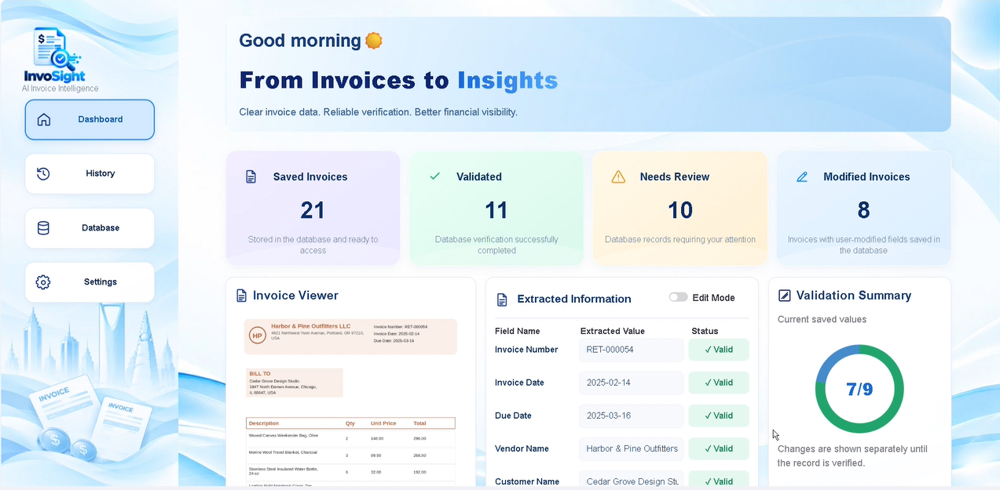
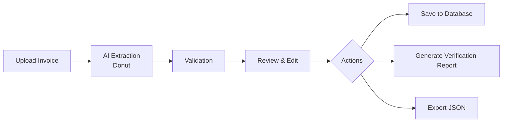
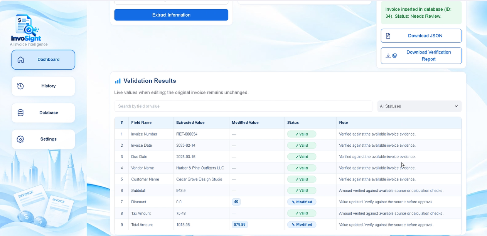
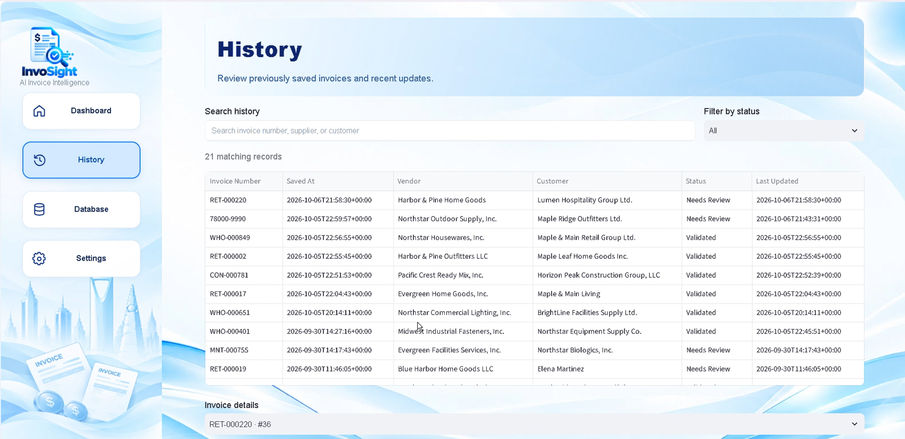
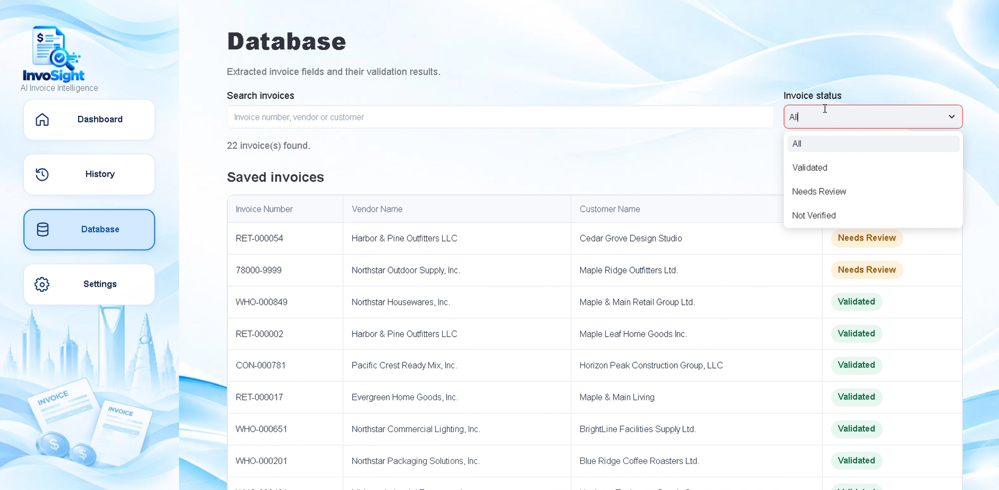
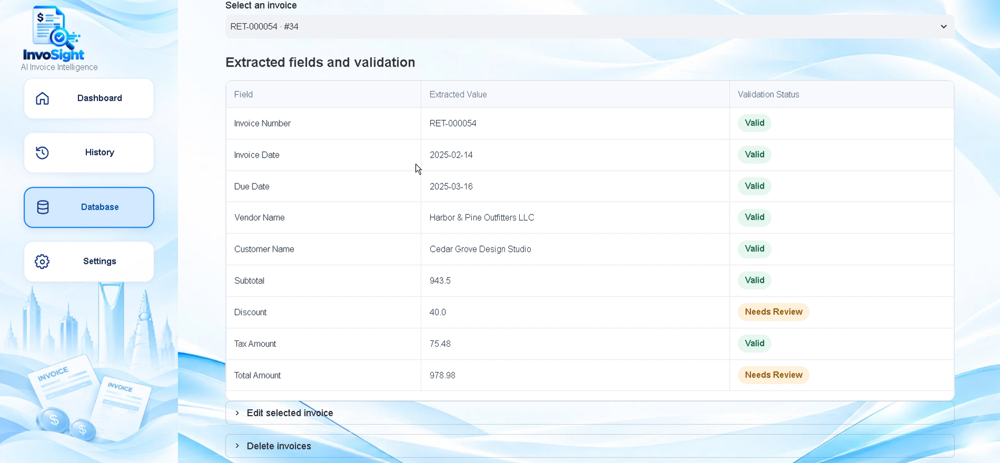
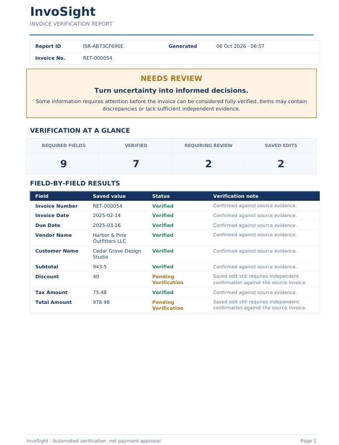
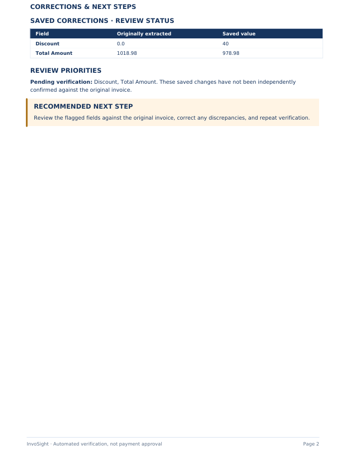
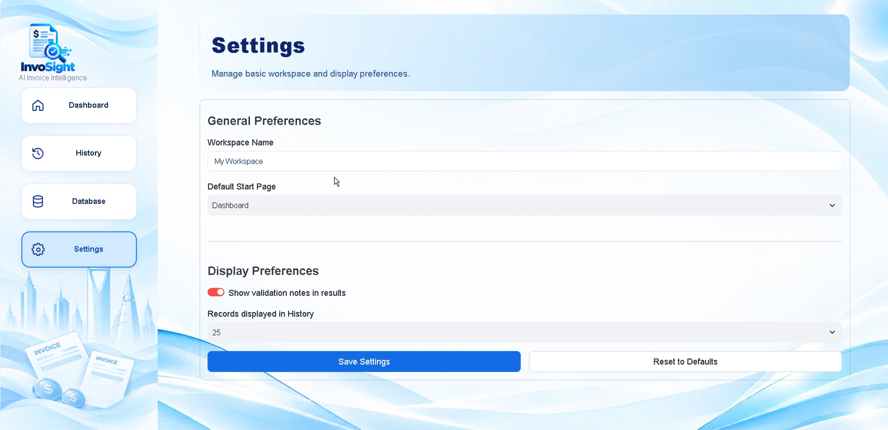

<div align="center">

# InvoSight

### AI-Powered Invoice Extraction, Verification & Financial Intelligence

**From Invoices to Insights**

*Turning invoice documents into structured information, clear validation results, and review-ready records.*

[Live Demo](https://invosight.streamlit.app/) · [GitHub Repository](https://github.com/wejdan20fa/InvoSight)

</div>

---

## 📌 Overview

**InvoSight** is an end-to-end AI-powered invoice processing and verification system. It extracts key information directly from invoice images, validates the extracted values, checks financial calculations, highlights fields that require review, allows users to correct values when needed, and stores the final records for future access.

The system brings the full workflow into one interface: **upload → extract → validate → review & edit → take action**. After validation, users can **save the invoice to the database, generate a verification report, or export the extracted data as JSON**.

<p align="center">
  
</p>

*Figure 1. InvoSight project overview and end-to-end workflow.*

---

## 🖥️ Application Preview

### Interactive Dashboard — From Invoice to Insight

The **InvoSight Dashboard** provides one workspace for invoice processing. Users can upload an invoice image, view the original document, extract structured fields with the AI model, inspect field-level validation results, review or edit values, and choose the next action after verification.

The summary cards provide a quick view of saved, validated, review-required, and modified invoice records, while the invoice viewer, extracted information panel, and validation summary keep the document and its results visible together.

<p align="center">
  
</p>

*Figure 2. The main InvoSight dashboard.*

---

## 🎯 The Challenge & Our Solution

### The Challenge

Invoice processing involves more than entering text into a system. Financial teams often need to locate important invoice fields, enter or review them manually, check whether the extracted values match the source document, verify financial calculations, identify discrepancies, correct errors, and keep a record of the final result.

When this process is repeated across a large number of invoices, manual review becomes **time-consuming, repetitive, and prone to human error**, which can slow down financial workflows and make inconsistencies harder to identify.

### Our Solution

**InvoSight** combines AI-based extraction, independent document evidence, financial validation, human review, and record management in one workflow.

The system extracts structured information directly from invoice images using a fine-tuned **Donut** model. It then applies validation rules and OCR-based evidence to identify incorrect, suspicious, missing, or insufficiently verified values before the final result is saved.

### How InvoSight Works



**1. Upload Invoice**  
The user uploads an invoice image in PNG or JPG format.

**2. AI Extraction**  
The fine-tuned Donut model reads the invoice image and converts the required information into structured invoice fields.

**3. Validation**  
The extracted values are checked using document evidence and financial validation rules. The system identifies values that are valid and fields that require further review.

**4. Review & Edit**  
The user reviews the extracted information, inspects validation feedback, and corrects values when necessary.

**5. Actions**  
After validation and review, the user can choose one of three actions:

- **Save to Database:** Store the invoice, extracted values, and verification results for later access.
- **Generate Verification Report:** Create a structured PDF report containing the verification results and review information.
- **Export JSON:** Download the extracted invoice information as structured JSON data.

---

## 🧾 Dataset Development

### AI-Assisted Synthetic Invoice Generation

The project uses approximately **10,000 synthetic, single-page invoice images** with corresponding structured JSON records across **20 invoice templates**. Synthetic data was used instead of real customer invoices so the team could control the invoice content, layouts, annotations, and financial relationships during model development.

The dataset-generation workflow included:

1. **Synthetic invoice content generation:** Fictional invoice identifiers, supplier and customer information, dates, line items, and financial values were generated and organized into structured records.
2. **Financial consistency checks:** Python rules were used to validate the generated amounts and relationships between invoice fields.
3. **Invoice rendering:** Pillow was used to place the generated information onto predefined invoice templates.
4. **Image–annotation pairing:** Each rendered invoice image was paired with its corresponding structured JSON record for training and evaluation.

| Dataset Property | Description |
|---|---|
| Type | Synthetic invoice dataset |
| Size | Approximately 10,000 single-page invoices |
| Layout Variations | 20 templates |
| Content Generation | AI-assisted synthetic generation |
| Rendering & Validation | Python and Pillow |
| Annotations | Structured JSON |

> The dataset and trained model weights are not included in this public repository.

---

## ⚙️ System Architecture

| Component | Technology | Purpose |
|---|---|---|
| Document Extraction | Fine-tuned Donut | Extracts structured invoice information directly from images |
| Independent OCR Evidence | Tesseract OCR | Provides additional document evidence for verification |
| Validation Engine | Python | Checks extracted information and financial consistency |
| Interactive Application | Streamlit | Provides upload, extraction, review, editing, and export |
| Record Management | SQLite | Stores and retrieves saved invoice records |
| PDF Reporting | ReportLab | Generates structured verification reports |

A financial calculation that passes does **not** automatically prove that an extracted value matches the original invoice. InvoSight therefore separates **source verification** from **financial consistency checks** and surfaces fields that still require review.

---

## ✨ Key Features

- **AI-powered invoice extraction:** Extracts key invoice fields automatically from invoice images.
- **Field-level validation:** Evaluates extracted information and clearly shows validation status for each field.
- **Financial validation:** Checks relationships between subtotal, discount, tax, and total to detect calculation inconsistencies.
- **Discrepancy detection:** Flags suspicious, missing, mismatched, or insufficiently verified values.
- **Review & edit:** Allows users to inspect and correct extracted values before saving.
- **Database storage:** Saves verified invoice records for future access and management.
- **Invoice history:** Provides access to previously processed and saved invoices.
- **JSON export:** Downloads structured extracted information for reuse in other workflows.
- **Verification reports:** Generates professional PDF reports containing validation results and review information.

---

## 🗂️ Extracted Invoice Fields

| Field | Description |
|---|---|
| Invoice Number | Unique invoice identifier |
| Invoice Date | Invoice issue date |
| Due Date | Payment due date |
| Vendor Name | Issuing supplier |
| Customer Name | Receiving customer |
| Subtotal | Amount before discounts and tax |
| Discount | Applied discount amount |
| Tax Amount | Applicable tax amount |
| Total Amount | Final invoice amount |

---

## 🔎 Verification & Review

InvoSight does not treat extraction as the final result. Each extracted field is passed through the verification workflow so the user can see what was successfully validated and what still needs attention.

| Status | Meaning |
|---|---|
| **Valid** | The extracted value passed the available validation checks |
| **Needs Review** | A discrepancy was detected or the available evidence was insufficient |
| **Modified** | The user changed the originally extracted value |
| **Modified & Verified** | A saved correction passed independent source verification |
| **Pending Verification** | A saved change still requires independent source confirmation |

### Smart Validation

- **Document evidence:** Tesseract OCR provides independent text evidence from the invoice image.
- **Financial validation:** The system checks the relationship between **subtotal, discount, tax, and total**.
- **Field-level feedback:** Validation results are shown directly beside the extracted values so the user can focus on the fields that need attention.

---

## 🖥️ InvoSight in Action

### Validation Results — See What Needs Attention

The validation results table presents the extracted fields together with their current status. This makes it easy to distinguish successfully validated values from fields that require review.

<p align="center">
  
</p>

*Figure 3. Field-level validation results.*

### History — Track Previous Activity

The **History** page provides access to previously processed invoices and recent saved activity, allowing users to return to earlier records without repeating the extraction workflow.

<p align="center">
  
</p>

*Figure 4. Invoice processing history.*

### Database — Review, Edit & Manage Records

The **Database** page provides a searchable view of saved invoice records. Users can inspect stored invoice information and validation status, then open the management section to edit or delete saved records when necessary.

<p align="center">
  
  
</p>

*Figure 5. Database overview and record-management controls.*

### Verification Report — Turn Validation into a Review-Ready Document

InvoSight can generate a structured **PDF verification report** that summarizes the invoice information, validation results, detected issues, saved corrections, and recommended review actions. The report provides a clear document for follow-up and record keeping.

<p align="center">
  
  
</p>

*Figure 6. Two-page verification report generated by InvoSight.*

### Settings — Configure the Application Experience

The **Settings** page provides a dedicated place for general application and display preferences.

<p align="center">
  
</p>

*Figure 7. InvoSight settings interface.*

---

## 🛠️ Technology Stack

**AI & Machine Learning:** Python · PyTorch · Hugging Face Transformers · Donut  
**Document Processing:** Tesseract OCR · Pillow  
**Application:** Streamlit  
**Data & Storage:** SQLite · JSON  
**Reporting:** ReportLab  
**Development:** Git · GitHub

---

## 📁 Repository Structure

```text
InvoSight/
├── App.py
├── Database.py
├── Dount_backend.py
├── ocr_evidence.py
├── validation_rules.py
├── report_generator.py
├── InvoSight_Assets/
│   ├── logo-full.png
│   ├── dashboard-background.png
│   ├── project-overview.png
│   ├── dashboard-preview.png
│   ├── validation-results.png
│   ├── history-preview.png
│   ├── database-overview.png
│   ├── database-edit-delete.png
│   ├── report-page-1.png
│   ├── report-page-2.png
│   └── settings-preview.png
├── requirements.txt
├── packages.txt
├── .gitignore
└── README.md
```

The local virtual environment, trained model weights, dataset, and local development files are excluded from version control.

---

## 🚀 How to Run the Application

### 1. Clone the repository

```bash
git clone https://github.com/wejdan20fa/InvoSight.git
cd InvoSight
```

### 2. Create and activate a virtual environment

```bash
python -m venv .venv
```

**Windows (PowerShell):**

```powershell
.\.venv\Scripts\Activate.ps1
```

**macOS / Linux:**

```bash
source .venv/bin/activate
```

### 3. Install Python dependencies

```bash
python -m pip install -r requirements.txt
```

### 4. Configure OCR and model files

Install the **Tesseract OCR** executable and ensure it is available to the application.

The trained model weights are not included in this repository. Place the required model files in the expected model directory before running extraction.

### 5. Run InvoSight

```bash
streamlit run App.py
```

Streamlit will open the application locally, typically at `http://localhost:8501`.

---

## 📊 Project Outcomes & Organizational Value

InvoSight demonstrates an end-to-end Document AI workflow that connects **invoice extraction, source-aware verification, financial validation, human review, structured storage, and professional reporting** in one application.

For financial teams, the intended value is to reduce repetitive manual entry and checking, make discrepancies easier to identify, and allow reviewers to focus their attention on invoices and fields that actually require follow-up.

---

## ⚠️ Known Limitations

- Extraction performance can vary with invoice layout, image resolution, and document quality.
- OCR evidence may be incomplete when text is unclear, overlapping, or difficult to recognize.
- A financially consistent calculation does not independently prove that the extracted value matches the original document.
- Automated validation supports human review and does **not** constitute final financial or payment approval.

---

## 👥 InvoSight Development Team

- **Wejdan Alnafai**
- **Nehal Alzahrani**
- **Saja Albuqami**
- **Reham Alhejaili**
